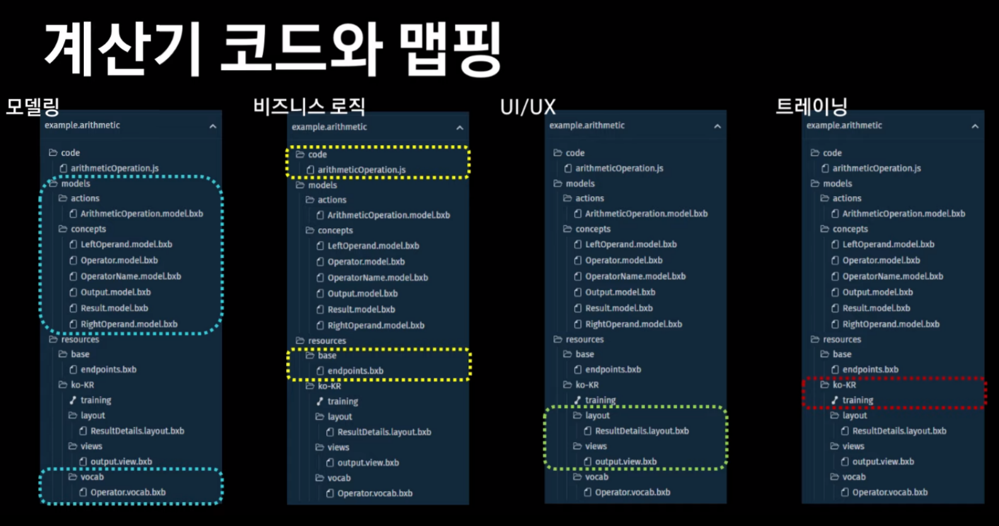

# 소중한아기(SOA)


## 목차

1. [Bixby Capsule란?](#Bixby-Capsule란?)
2. [캡슐구조](#캡슐구조)
3. [캡슐설정](#캡슐설정)
4. [Scenario](#Scenario)
5. [Models](#Models)
6. [비니지스로직](#비지니스로직-JS.Code)
7. [Resources](#Resources)
8. [UI/UX](#UI/UX)
9. [외부 어플리케이션 실행](#외부-어플리케이션-실행)
10. [부록](#부록)  


## Bixby Capsule란?

> 빅스비는 삼성전자가 2017년 3월 30일에 공개한 음성인식 기반 개인 비서 애플리케이션이며, 빅스비 캡슐이란 빅스비 사용에 필요한 기능과 서비스가 통합돼 동작하는 넷플릭스나 스포티파이, 우버와 같은 가상의 어플리케이션이다. 


## 캡슐구조

캡슐의 구조는 모델링, 비즈니스 로직, UI/UX, 트레이닝으로 구성되어 있습니다.




### 2.1 모델링

**Concepts**: 발화 인식 및 발화 결과를 리턴할 때 필요한 값

예)"4개월 이유식 추천해줘"
	  4 -> Month, 이유식 -> BabyFood , 추천해줘 -> Recommendation

**Actions**: 캡슐이 사용자가 원하는 작업을 이해하도록 수행할 동작을 정의


### 2.2 비즈니스 로직

**Javascript Code**: 사용자가 원하는 작업을 실제 수행하는 코드로서 이 단계에서 서비스 API를 연동


### 2.3 UI/UX

**Bixby Views**: 최종 결과를 사용자에게 보여주는 레이아웃 작업

**Dialog**: 사용자에게 되묻거나 결과를 응답해주는 응답문을 생성


### 2.4 트레이닝

**발화 Training**: Capsule이 잘 동작하도록, 처리할 수 있는 발화를 생성하고 자연어 트레이닝을 진행

**Debugging**: 개발한 캡슐이 구현한대로 동작하는지 확인


## 캡슐설정

빅스비 캡슐 개발 진행하면서 설정해야되는 부분에 대한 설명하도록 하겠습니다.
이는 빅스비 캡슐을 마켓플레이스에 등록할 때 사용하는 [체크리스트]( https://drive.google.com/file/d/1oPZ2hY1X2EKgyWcsPU3VZ-DgC4t2_njT/view)를 보면서 진행하면 더 수월합니다.

### 3.1 Capsule.bxb 파일 업데이트

> 캡슐을 생성하면 자동으로 생성됩니다. capsule.bxb 파일에서는 캡슐 버전, 캡슐 지원 언어 및 디바이스 등을 설정할 수 있습니다 

```java
 capsule {
  id (idear.soa)
  //캡슐 버전 설정
  version (1.0.0) 
  format (3)
  //캡슐 언어 설정
  targets {
    target (bixby-mobile-ko-KR) 
  }
  permissions {
    user-profile-access
  }
  //마켓플레이스 스토어 섹션 설정   
  store-sections { 
    section (EducationAndReference)
    section (HealthAndFitness)
  }
}
```

### 3.2 Capsule-info.bxb 파일 생성

> 캡슐 이름, 홈페이지, 캡슐 로고 URL 등 여러분의 캡슐에 대한 정보를 저장합니다.

```java
capsule-info {
  //사용자에게 보이는 캡슐 이름
  display-name  (소중한아기) 
  developer-name  (I-Dear)
  icon-asset  (/img/bixby_launcher.png)
  description ("아기에 대한 여러가지 정보를 제공하는 아기 백과사전 캡슐입니다.")
  //개인정보 활용에 대한 동의 링크    
  privacy-policy-url(https://docs.google.com/document/d/e/2PACX-1vQDEcc03V34CL4mzwpxypdog71r3eNW4M1rW6T9IUoopv9k20PhS-7CqwxZpwjp9poCQj5DoI77VMMm/pub)
  //사용자가 부르는 캡슐 이름                   
  dispatch-name (소중한아기) 
  //마켓플레이스에서 사용자가 캡슐을 검색할 떄 사용하는 키워드                   
  search-keywords{ 
    keyword (아기)
    keyword (이유식)
    keyword (병원)
    keyword (산모)
    keyword (육아)
  }
}
```

### 3.3 Hints 

> Hints를 통해 사용자에게 추천 발화를 제공	

```java
hints {
  uncategorized {
    hint ("소중한아기에서 이유식을 추천받고 싶다면") {
      preferred-hint ("아기 이유식 추천해줘")
    }
    hint ("소중한아기에서 예방접종 정보를 얻고 싶다면") {
      preferred-hint ("6세 예방접종 알려줘")
    }
    hint ("소중한아기에서 병원 위치 정보를 얻고 싶다면") {
      preferred-hint ("근처 병원 보여줘")
    }
    hint ("소중한아기에서 산모, 아기의 정보를 얻고 싶다면") {
      preferred-hint ("10주차 아기 상태 알려줘")
    }
  }
}
```


## Scenario

> 설명

캡슐 기능을 구현하기 전, 기능을 기획하는 단계에서 작성하는 것

- 구현할 캡슐의 목적
- 사용자가 입력할 말
- 발화함수
- 발화변수
  - Input Concept
  - Output Concept

```
# [목적]
# 근처 병원 및 보건소 정보 제공

# [사용자가 입력할 말]
# 근처 보건소 어디야?
# 근처 병원 어디야?
# 00병원 정보 보여줘

# [발화함수이름 : Action]
# Hospital

# [발화변수이름 : Input Concept]
# 보건소 ==> InputPublicHealth
# 병원 ==> InputHospital

# [발화변수이름 : Output Concept]
# NearHospital
```


## Models

> 설명

`Concepts` 발화 인식 및 발화 결과를 리턴할 때 필요한 값

`Actions` 사용자가 원하는 작업을 이해하도록 수행할 동작을 정의

```
Input Concept과 Output Concept, type를 설정
```


> 디렉토리 상세

- actions : /babyfood, /hospital, /pregnancyStatus, /vaccine
- concepts : /babyfood, /base, /hosptial, /pregancyStatus, /vaccine


|    분야    | Concept | Action |
| :--------: | :-----: | :----: |
|    언어    |  명사   |  동사  |
| 프로그래밍 |  변수   |  함수  |

### 4.1 Concepts


### 4.2 Actions

> 설명

`Type: ` Action의 종류 설정하는 부분

`Input: ` Action 실행에 필요한 인력 값을 지정하는 부분

	-	변수명: Action에서 해당 Concept이 사용되는 이름
	-	Concept명: Concept의 이름
	-	Min&MAX: 발화로부터 input이 몇 개 받아들이지 결정

`Output:` Action 실행의 결과

```
action (RecommendationBabyFood) {
  description (아기이유식 추천 및 검색)

  collect {
    input (month) {
      type (Month)
      min (Optional) max (One)
    }
    input (ingredients) { 
      type (Ingredients)
      min (Optional) max (One)
    }
    input (babyFood) {
      type (BabyFood)
      min (Required) max (One)
    }
    input (recommendation) {
      type (Recommendation)
      min (Optional) max (One)
    }
  }
  type(Search)
  output (BabyFoodList){
    on-empty{
      halt{
        dialog{
          template ("검색된 이유식이 없습니다. '4~24개월 이유식 추천해줘' 또는 '이유식 추천해줘'를 다시 말해주세요")
        }
      }
    }
  }
}
```


## 비니지스로직

> 설명

`javaScript `  사용자가 원하는 작업을 실제 수행  


## Resources

> 설명

`base` 폴더의 `endpoints.bxb`

`ko-KR` 폴더는 한국어와 관련된 resources를 모아놓은 폴더

- training: 캡슐의 기능에 대한 발화를 생성 및 학습하고 디버깅 할 수 있는 파일
- layout과 view 폴더: 캡슐의 결과 화면의 UI/UX를 구성하는 폴더
- vocab폴더: 동의어 처리, 특정 단어를 처리하는 폴더
- capsule-info.bxb: 마켓 플레이스에 등록할 때 사용하는 파일
- soa.hints.bxb: 캡슐의 사용 예시를 알려주는 파일

> 디렉토리 상세

- base : endpoints.bxb
- ko-KR : training,  /layouts,  /views, /vocab, capsule-info.bxb, soa.hints.bxb

### 7.1 Test&Debug

### 7.2 UI/UX


## 외부 어플리케이션 실행

